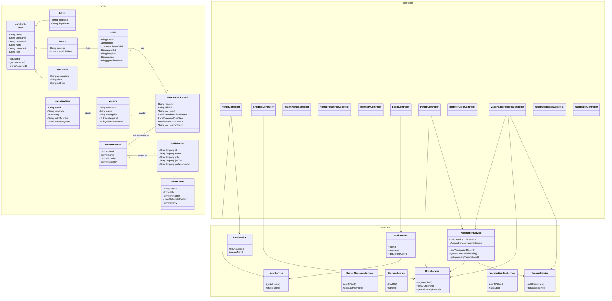

# Project UML Class Diagram

```mermaid
classDiagram
    namespace model {
        class User {
            <<abstract>>
            -String userId
            -String username
            -String password
            -String name
            -String contactInfo
            -String role
            +getUserId()
            +getUsername()
            +checkPassword()
        }
        class Admin {
            -String hospitalId
            -String department
        }
        class Parent {
            -String address
            -int numberOfChildren
        }
        class Vaccinator {
            -String vaccinatorId
            -String siteId
            -String address
        }
        class Child {
            -String childId
            -String name
            -LocalDate dateOfBirth
            -String parentId
            -String hospitalId
            -String gender
            -String guardianName
        }
        class VaccinationRecord {
            -String recordId
            -String childId
            -String vaccineId
            -LocalDate dateAdministered
            -LocalDate nextDueDate
            -VaccinationStatus status
            -String vaccinationSiteId
        }
        class Vaccine {
            -String vaccineId
            -String name
            -String description
            -int dosesRequired
            -int daysBetweenDoses
        }
        class VaccinationSite {
             -String siteId
             -String name
             -String location
             -String capacity
        }
        class HealthAlert {
            -String alertId
            -String title
            -String message
            -LocalDate datePosted
            -String priority
        }
        class InventoryItem {
            -String itemId
            -String vaccineId
            -int quantity
            -String batchNumber
            -LocalDate expiryDate
        }
        class StaffMember {
            -StringProperty id
            -StringProperty name
            -StringProperty role
            -StringProperty jobTitle
            -StringProperty professionalId
        }
    }

    namespace services {
        class AlertService {
            +getAllAlerts()
            +createAlert()
        }
        class AuthService {
            +login()
            +register()
            +getCurrentUser()
        }
        class ChildService {
            +registerChild()
            +getAllChildren()
            +getChildrenByParent()
        }
        class HumanResourceService {
            +getAllStaff()
            +addStaffMember()
        }
        class StorageService {
            +loadAll()
            +saveAll()
        }
        class UserService {
            +getAllUsers()
            +createUser()
        }
        class VaccinationService {
            -ChildService childService
            -VaccineService vaccineService
            +addVaccinationRecord()
            +getVaccinationSchedule()
            +getUpcomingVaccinations()
        }
        class VaccinationSiteService {
             +getAllSites()
             +addSite()
        }
        class VaccineService {
            +getAllVaccines()
            +getVaccineById()
        }
    }

    namespace controllers {
        class AdminController
        class ChildrenController
        class HealthAlertsController
        class HumanResourceController
        class InventoryController
        class LoginController
        class ParentController
        class RegisterChildController
        class VaccinationRecordsController
        class VaccinationSitesController
        class VaccinatorController
    }

    %% Inheritance Relationships
    User <|-- Admin
    User <|-- Parent
    User <|-- Vaccinator

    %% Service Dependencies
    VaccinationService --> ChildService
    VaccinationService --> VaccineService
    AuthService --> UserService
    
    %% Controller Dependencies (Representative)
    VaccinationRecordsController --> VaccinationService
    VaccinationRecordsController --> ChildService
    VaccinationRecordsController --> VaccineService
    LoginController --> AuthService
    AdminController --> UserService
    AdminController --> AlertService
    ChildrenController --> ChildService
    ParentController --> ChildService
    ParentController --> VaccinationService

    %% Model Relationships
    Child "1" -- "*" VaccinationRecord : has
    Parent "1" -- "*" Child : has
    Vaccine "1" -- "*" VaccinationRecord : used in
    VaccinationSite "1" -- "*" VaccinationRecord : administered at
    VaccinationSite "1" -- "*" StaffMember : works at
    InventoryItem -- Vaccine : stocks
```
